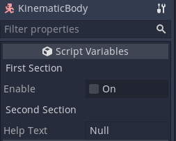

# Godot Inspector Headers
Unity-like inspector headers for Godot 3 implemented as a C# plugin for those of us who want to use C# in godot and like the ability to add simple organization to exported properties within the inspector.

## Installation
1) Download the source code and drag it into your Godot project. It should be located at the root `res://`
2) Check that you now have the `res://addons/InspectorHeaders/` in your project along will all associated .cs files and a `plugin.cfg` file. 
3) Build your project. C# support in Godot 3 is... iffy so you need to build your project so that the assemblies exist in order for the plugin to be enabled. 
4) Project > Project Settings > Plugins 
	- Update
	- Enable **InspectorHeaders**
	
## Usage
Simply add the **Header** attribute above any fields/properties where you want to indicate a new section. This will dynamically insert a label above the annotated property.
```cs
using Qkmaxware.GodotAddons.Inspector;
using Godot;
using System;

public class MyBody : KinematicBody {
	[Header("First Section")]
	[Export] public bool Enable;
	
	[Header("Second Section")]
	[Export] public string HelpText;
	...
}
```
In the example above, the plugin will insert a label titled "First Section" above the Enable field and a second label titled "Second Section" above the HelpText field. 

